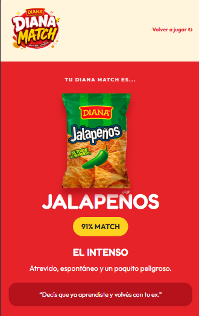
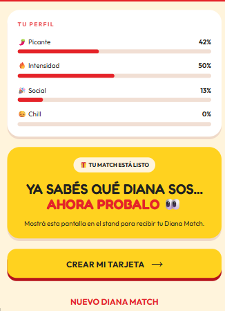
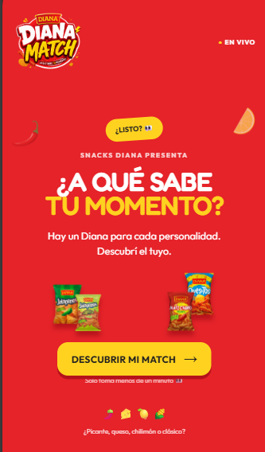
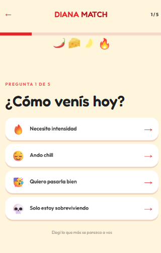

# Diana Match

Activación de marca interactiva para Snacks Diana: quiz de personalidad, resultado compartible y dashboard de presentación.

## Algunas capturas de la aplicacion





## Ejecutar

```bash
npm install
npm run dev
npm run build
```

El quiz funciona sin Supabase. Copiá `.env.example` a `.env` y agregá `VITE_SUPABASE_URL` y `VITE_SUPABASE_ANON_KEY` para guardar resultados anónimos. Ejecutá `supabase.sql` en el SQL Editor de Supabase. La política solo permite inserts anónimos; el dashboard incluido usa un estado vacío/demo y puede conectarse después a una RPC o vista agregada.

## Rutas y modos

- `/` landing, `/quiz` experiencia, `/result` resultado, `/live` dashboard.
- `/?source=qr` muestra el contexto de stand en el resultado.
- `/?source=kiosk` agrega el modo kiosco y reinicia el resultado después de 60 segundos.

## Personalización

Productos y perfiles: `src/data/products.ts`. Preguntas y scoring: `src/data/quiz.ts` y `src/quiz/scoring.ts`. Los emojis son placeholders reemplazables por WebP en esos archivos. El logo actualmente es un wordmark para que la app no dependa de assets externos.

## Deploy

Es una SPA compatible con Vercel. Usá el preset Vite y agregá las variables `VITE_*` si se requiere persistencia.
